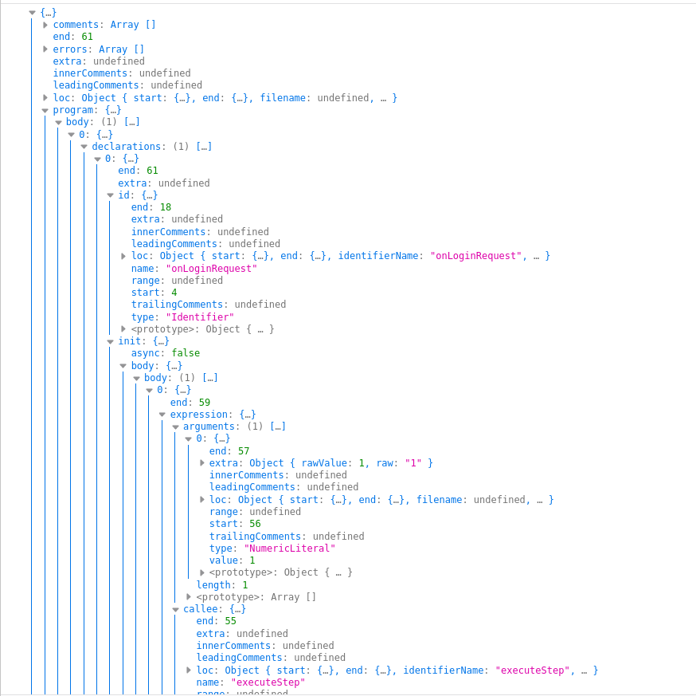

# Technology Selection

### Script Editor Implementation

- Considered CodeMirror, Eclipse Che, Ace, and Monaco editors for implementing the script editor and finally decided to implement the script editor using Monaco.
- [Monaco editor](https://microsoft.github.io/monaco-editor/) is a browser-based editor written in TypeScript, and it has the following advantages.
    - Supports several languages and themes
    - Out of the Box Intellisense with Auto-completion, Bracket matching, Errors & warnings
    - Lots of [editor options](https://microsoft.github.io/monaco-editor/api/interfaces/monaco.editor.ieditoroptions.html)
- Also, since the Monaco editor powers VS Code, we will be able to integrate this with the VS-Code plugin later for debugging purposes.

### Abstract Syntax Tree

- An Abstract Syntax Tree(AST) is used to keep the track of the script in Authentication Flow Composer and to implement the mapping between the script and the UI based flow.
- Considered the acorn, esprima, cherow, and babel libraries for parsing the script into an AST.
- Unlike other libraries, [babel](https://github.com/babel/babel) has its own libraries for parsing code to AST, generating code from AST, and traversing through the AST. So babel is chosen over others.

### UI based Flow (Visual Flow) Implementation
- Considered React Diagrams, React Flow, and React Flow Chart libraries for implementing the UI based flow.
- [React Flow](https://reactflow.dev/) supports building customized nodes based graphs, fast rendering, and is very active in GitHub compared to other compatible libraries. So React flow library is used to implement UI based flow.

More details on the technologies and alternatives for them can be found in the following document.
https://drive.google.com/file/d/16i2HHWDIDHFmz7m0YkKAcob4R7Iiq60e/view?usp=sharing
